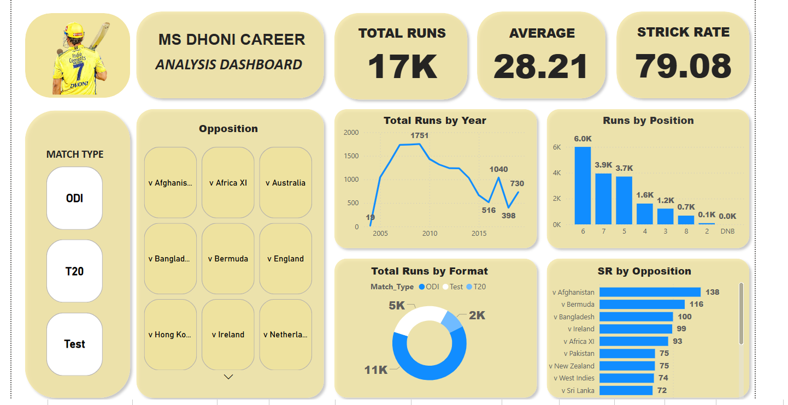

# 🏏 **MS Dhoni Career Analysis Dashboard – Power BI**
This Power BI project delivers an interactive visual analysis of former Indian cricket captain MS Dhoni's international career, highlighting his batting performance across formats, years, and opponents.

---

# 📌 **KeyFeatures**
- ✅ **Total Runs:** 17,000+ across all formats

- ✅ **Batting Average:** 28.21

- ✅ **Strike Rate:** 79.08

- ✅ Format-wise runs breakdown: ODI, T20I, Test

- ✅ Year-wise runs trend (line chart)

- ✅ Runs distribution by batting position

- ✅ Strike rate comparison against different international teams

- ✅ Filter by opposition team for detailed analysis

- ✅ Match type slicer: ODI, T20I, Test

---

# 📊 **Visuals Included**

- **KPI Cards:** Total Runs, Batting Average, Strike Rate

- **Line Chart:** Runs scored by year

- **Bar Chart:** Runs by batting position

- **Pie Chart:** Runs by match format

- **Bar Chart:** Strike rate against each opposition

- **Slicers:** Match Type, Opposition

---

# 🔧 **Tools & Technologies**
- **Power BI Desktop**

- **DAX (for KPIs and calculated columns)**

- **Excel (for raw data preparation)**

- **Custom Themes & Interactive Slicers**

---

## 📸 **Dashboard Preview**

---

## 🎯 **Key Insights**

- MS Dhoni scored the **most runs in 2007** with 1751+ total.
- **Batting at position 6** brought the highest number of runs (6K).
- Best strike rate (138) recorded against **Afghanistan**.
- ODI format dominates his scoring with over **11K runs**.
- Performance visualized across various international teams.

---

## 📁 **Files Included**

- [MSDhoni_Career_Analysis_file](MSDhoni_Career_Analysis.pbix) PowerBI file with raw data, Charts,Slicers,Cards and final dashboard
- [MS Dhoni Career Dashboard](MSDhoni_Career_Analysis_Dashboard.png) Dashboard image preview
- [Readme File](README.md) Project documentation

---

## 📬 **Contact**

 **Abhishek Thakre**   
🔗 [LinkedIn](https://www.linkedin.com/in/abhishek-thakre13)  
💻 [GitHub](https://github.com/AbhiThakre45)

---

## 📌 **Note**

*This project demonstrates real-time sports analytics using Power BI, highlighting effective storytelling through data visualization.*

